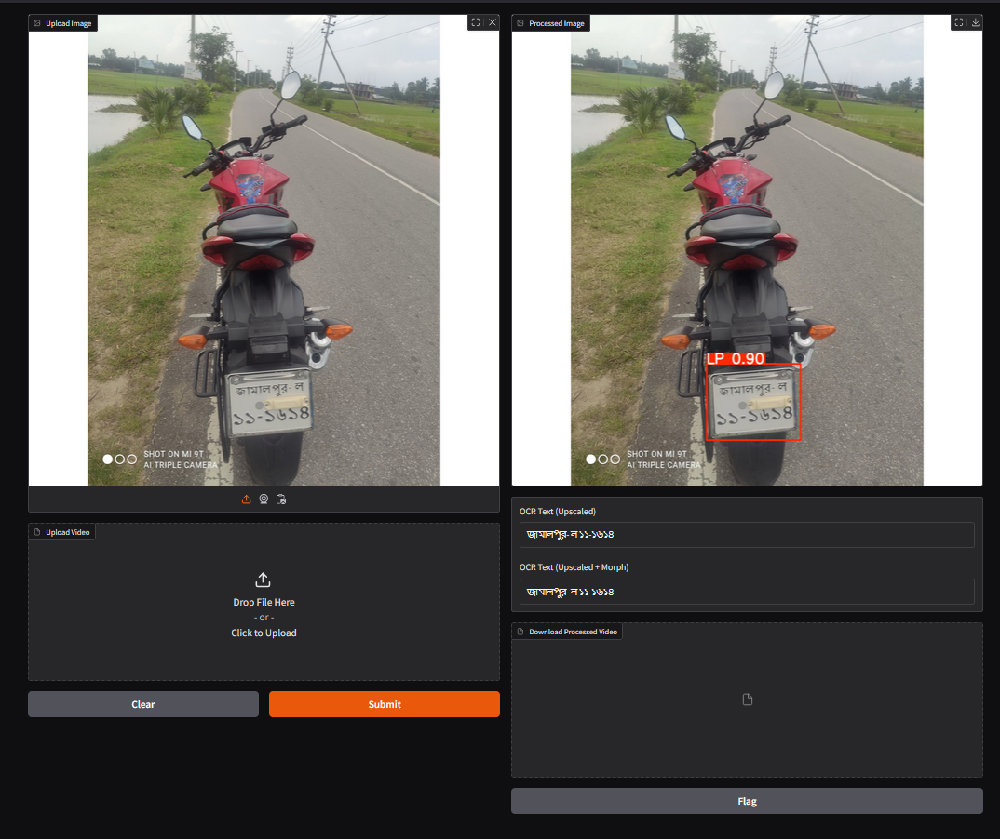
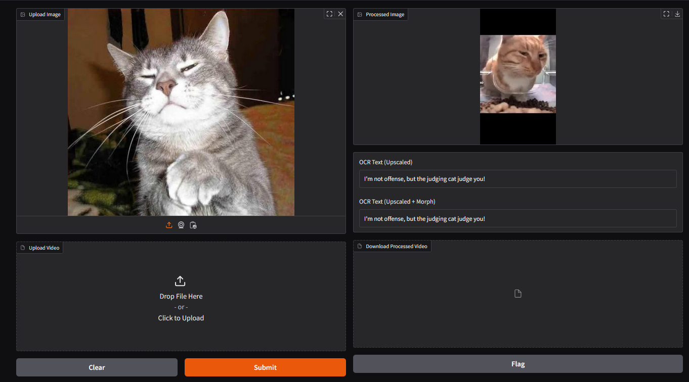
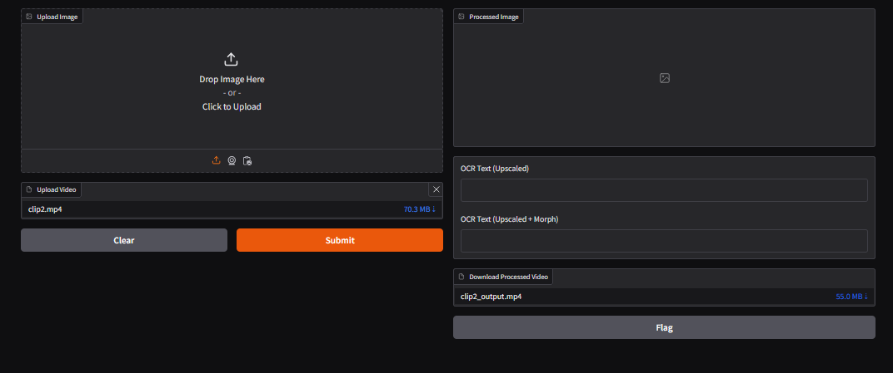

# Get Started

## Breif Story:

This model is yolov5-s model which is trained on custom image dataset. The main purpose of this work is to detect Bangladeshi vehicle number plate and recognize the number plate by using easyocr.

## To see my work:
First, clone this repository. After that, follow those quick steps:

## Virtual Environment:

1. Create virtual Environment
```bash
python -m venv deploy
```
2. Activate the Enviroment:

```bash
deploy\Scripts\activate
```

## Install Dependencies:

1. Install Libraries

```bash
pip install -r requirements.txt
```
2. Clone the repository of image upscaling DL model

```bash
git clone https://github.com/fannymonori/TF-ESPCN.git
```

## Run my code:

```bash
python webui/detect_recog_ui.py
```
## Outcomes

1. Read Image file



2. Error Handle



3. Process Video file



4. Video accuracy:

[](https://drive.google.com/file/d/1LnKXFotfC6AccLzRyKlaFYWXOtusHg47/view?usp=sharing)

## Reference:

1. <a href="https://github.com/fannymonori/TF-ESPCN.git"> TF-ESPCN GITHUB

2. <a href="https://github.com/ultralytics"> ULTRALYTICS GITHUB

3. <a href="https://github.com/ultralytics/yolov5"> YOLOV5 GITHUB

4. <a href="https://github.com/JaidedAI/EasyOCR"> EASYOCR GITHUB