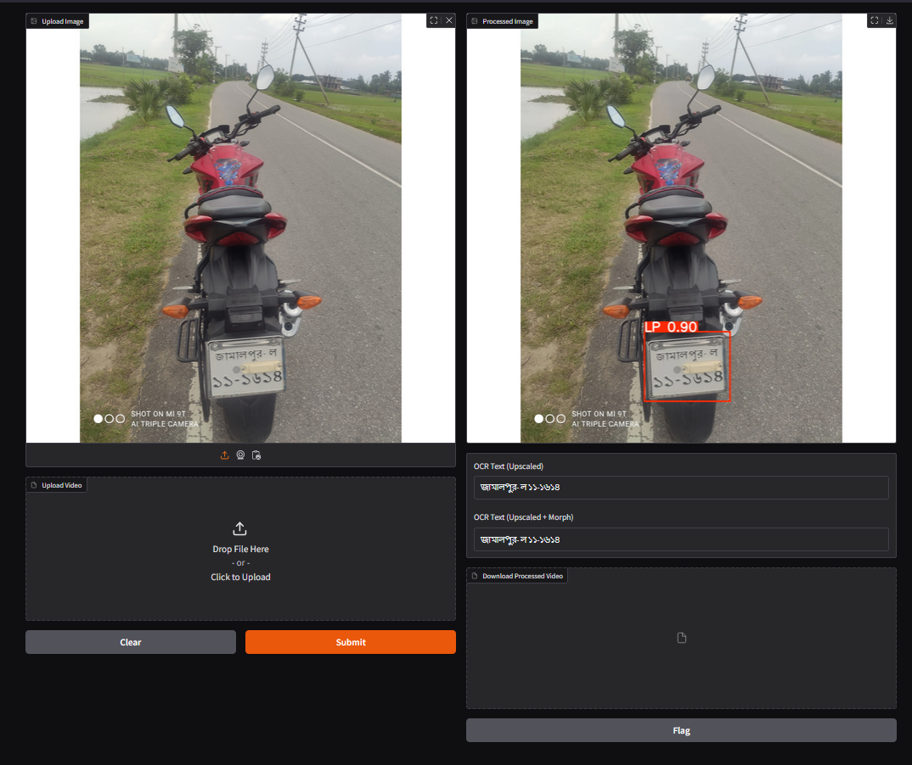
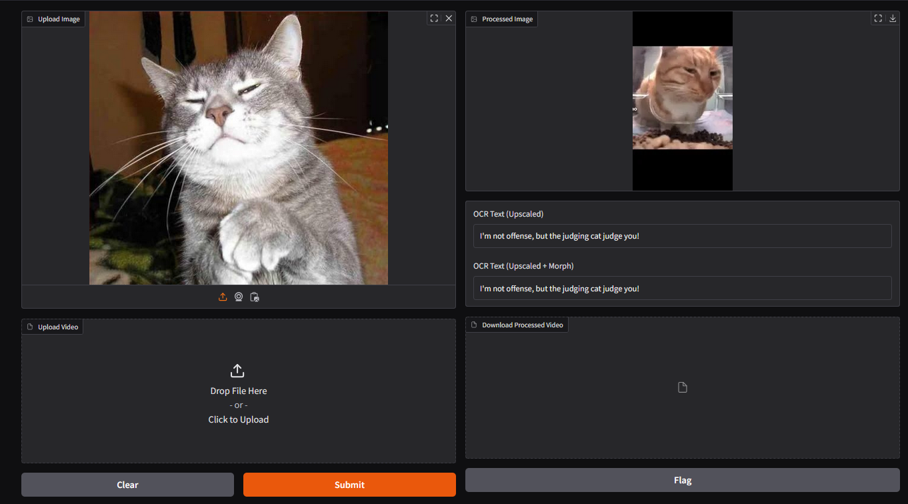
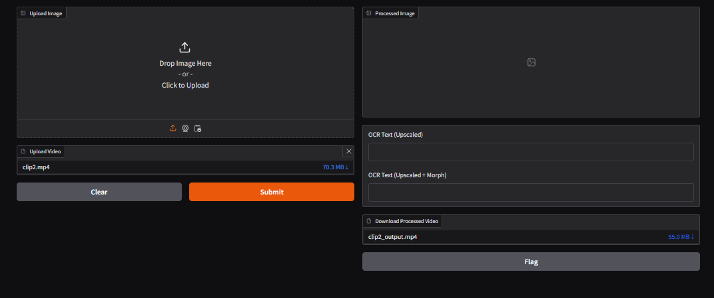

## Abstract

 Automatic Number Plate recognition systems also known as ANPR are important for intelligent
transportation systems, traffic monitoring, and law enforcement. Every country follows
different types of vehicle license plates. In Bangladesh, we also have different types of number
plates. Our research introduces an effective methodology employing YOLOv5s for number
plate detection and EasyOCR for character recognition. Bangla vehicle license plate has
complex syntax and character orientation. For object detection, we apply different types of
deep learning models, including YOLOv5s, YOLOv8n, YOLOv9e, SSD, and Faster R-RCNN,
using two datasets: a custom dataset of 2358 images specifically curated to capture the
variations in Bangla number plates (including different fonts, scripts, and background
conditions) and the publicly available Bangla LPDB-A dataset with 1717 images. Our proposed
model, YOLOv5s, shows outstanding performance on both datasets, achieving a mean Average
Precision (mAP) of 99.5% on the custom dataset and 99.4% on Bangla LPDB-A, showcasing
its robustness. Also, Faster R-CNN and SSD exhibit tendencies towards overfitting,
particularly with the custom dataset which includes more challenging scenarios. SSD struggles
with detecting smaller number plates due to feature loss, while Faster R-CNN, despite its
accuracy, proves computationally expensive for real-time applications. EasyOCR facilitates
efficient and precise text extraction from the detected number plates. However, in critical
conditions, we use the TF-ESPCN model to achieve better image resolution. It helps a little bit
to overcome the errors of EasyOCR. The results confirm that YOLOv5s is the best choice for
real-time Bangla vehicle number plate detection and recognition, making it highly suitable for
deployment in intelligent traffic monitoring and law enforcement systems within Bangladesh.

Keywords: Object Detection, Character Recognition, YOLOv5, EasyOCR 

## Outcomes

1. Read Image file

2. Error Handle

3. Process Video file

4. Video output:

5. Visualize work:

## Docker image

I created a docker image of this work you can find it <a href="https://hub.docker.com/r/mdzaif/bangla_anpr_web_app?uuid=82E2C6F2-260A-463A-9C55-5C31316A0266">here</a>

## Reference:

1. <a href="https://github.com/fannymonori/TF-ESPCN.git"> TF-ESPCN GITHUB

2. <a href="https://github.com/ultralytics"> ULTRALYTICS GITHUB

3. <a href="https://github.com/ultralytics/yolov5"> YOLOV5 GITHUB

4. <a href="https://github.com/JaidedAI/EasyOCR"> EASYOCR GITHUB